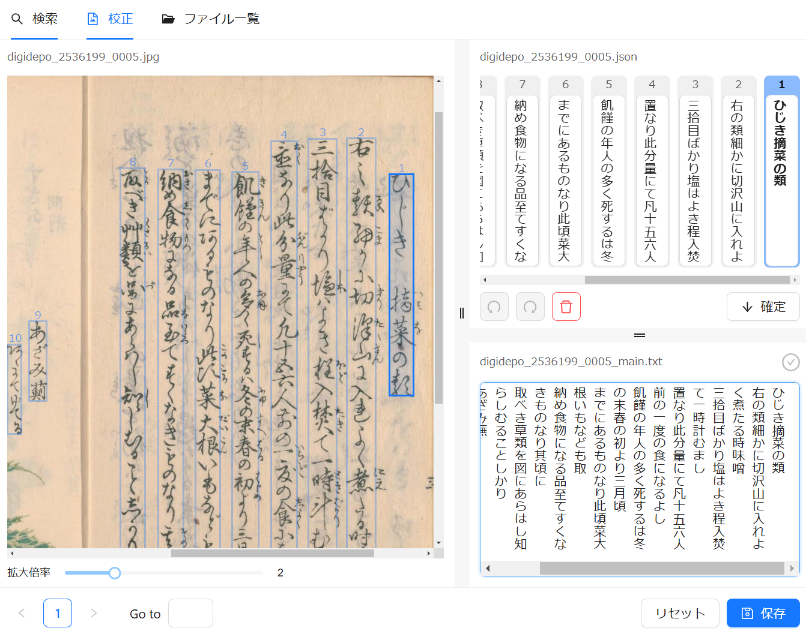

# OCR校正ツール

[NDL古典籍OCRアプリケーション](https://github.com/ndl-lab/ndlkotenocr_cli)を利用して取得するOCR結果を手動で校正するツールです。

## URL

[https://bakuhu-shokusei.github.io/proofreading/](https://bakuhu-shokusei.github.io/proofreading/)

## 手順

### OCR

`-a`[オプション](https://github.com/ndl-lab/ndlkotenocr_cli?tab=readme-ov-file#%E7%94%BB%E5%83%8F%E3%82%B5%E3%82%A4%E3%82%BA%E5%87%BA%E5%8A%9B%E3%82%AA%E3%83%97%E3%82%B7%E3%83%A7%E3%83%B3)を指定してOCRアプリを実行してください。

例

```
python main.py infer input_root output_dir -a
```

### 下記のようにフォルダを準備する

```
input_dir
  ├── book1
  │   ├── img
  │   │   ├── 001.jpg
  │   │   └── 002.jpg
  │   ├── txt
  │   │   ├── 001.txt
  │   │   └── 002.txt
  │   └── json
  │       ├── 001.json
  │       └── 002.json
  └── book2
      ├── img
      │   ├── 001.jpg
      │   ├── 002.jpg
      │   └── 003.jpg
      └── txt
          ├── 001.txt
          ├── 002.txt
          └── 003.txt
```

[例](https://github.com/bakuhu-shokusei/proofreading/tree/main/docs/example)

[例（ダウンロード用）](https://raw.githubusercontent.com/bakuhu-shokusei/proofreading/refs/heads/main/docs/example.zip)

### 校正

[ここ](https://bakuhu-shokusei.github.io/proofreading/)で先ほどのフォルダを選択し、校正作業に入ります。



スクショのように、構成画面は

-   左の部分（A）
-   右上の部分（B）
-   右下の部分（C）

三つの部分で構成されています。

流れとしては、

-   Aと照合してBを編集する（以下の操作ができます）
    -   内容の編集
    -   順番の調整（ドラッグ＆ドロップ）
    -   長方形自体を削除
-   「確定」ボタンを押して、Bの内容をCに移す
-   Cで更に編集する
